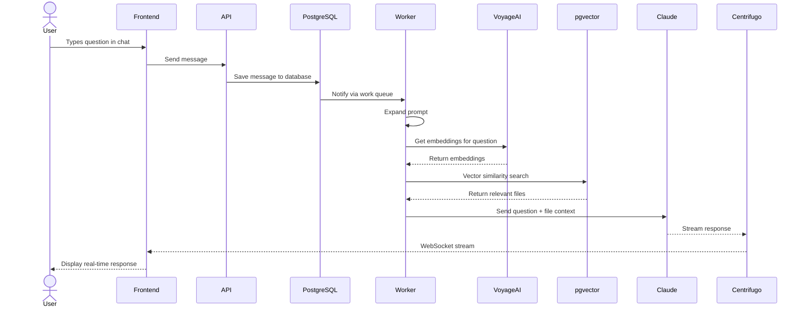
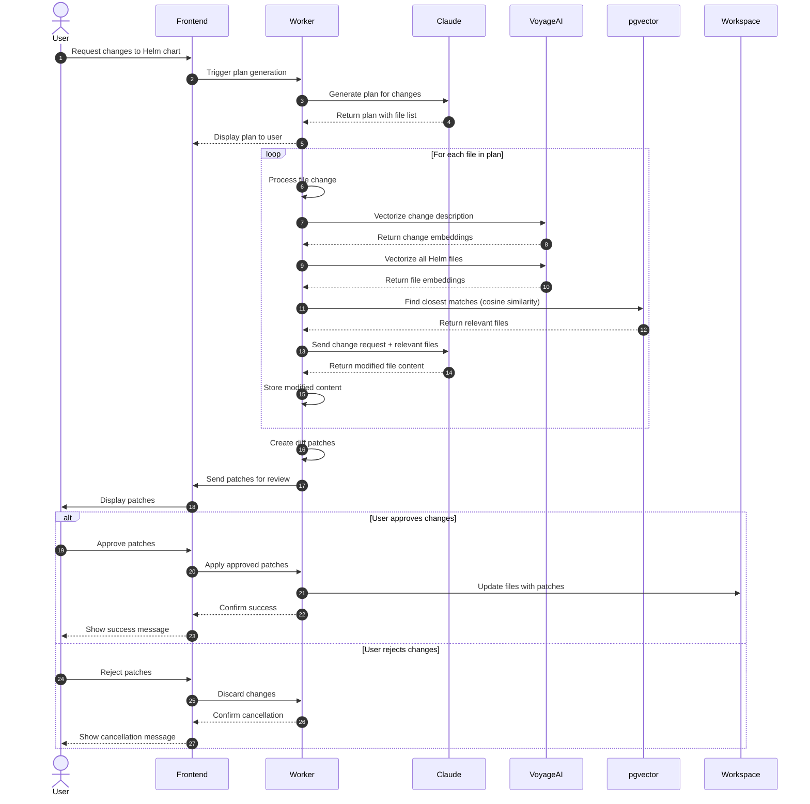

# Workflows

## Workflow 1: Initial User Input (Conversational Flow)

1. User types a question in the frontend chat interface
2. Frontend sends message to API endpoint → saves to database
3. Worker picks up job from PostgreSQL work queue
4. Expands the prompt to improve context understanding
5. Gets embeddings from Voyage AI to vectorize the question
6. Finds relevant files using vector similarity search in pgvector
7. Sends to Claude with the user's question + relevant file context
8. Streams response back through Centrifugo websocket
9. Frontend displays the streaming response in real-time

## Workflow 2: User Requests Changes (Plan Execution)

1. User asks for changes to their Helm chart
2. System generates a plan using Claude listing what files need changes
3. For each file change:
   - Vectorizes the change description using Voyage AI
   - Vectorizes every file in the Helm chart
   - Finds closest matches using cosine similarity
   - Sends to Claude: relevant files + specific change request
   - Claude returns complete modified file contents
4. Creates diff patches comparing original vs modified files
5. Sends patches to frontend for user review
6. User approves/rejects each change
7. Applies approved patches to update the workspace files

